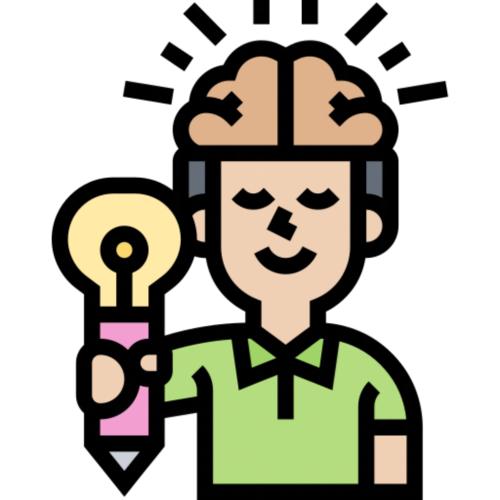

# TeamLLM: A Human-Like Team-Oriented Collaboration Framework for Multi-Step Contextualized Tasks

This repository contains the code, data, and evaluation resources for the paper:

**TeamLLM: A Human-Like Team-Oriented Collaboration Framework for Multi-Step Contextualized Tasks**

`[Paper link will be added here]`

TeamLLM proposes a human team-inspired multi-LLM collaboration framework for solving **multi-step contextualized tasks**, together with a new benchmark designed to evaluate **process-oriented thinking and creativity** in large language models (LLMs). This repository is an initial version. It will be further refined and updated with necessary figures and link from the paper after acceptance.

**NOTE:** Please note that the data in this repository is not yet complete. During the review stage, only one scenario and data presented in the paper appendix are publicly available. We will release scenarios, full-process responses and the corresponding human evaluation data after acceptance.


---
## 🚀 Contribution 1: TeamLLM Framework

`[TeamLLM framework figure will be added here]`

### Team-Oriented Multi-LLM Collaboration Framework

TeamLLM is a multi-LLM collaboration framework inspired by **Belbin’s Team Role Theory**. Instead of assigning LLMs to distinct functions or random roles, TeamLLM organizes LLMs into **human-like team roles**, enabling richer interaction and ensuring process controllability.

### Team Role Design

Each LLM is assigned a role defined by a triplet:
{ Team Role, Role Speciality, Role Prompt }


The framework adopts four team roles:

-  **Co-Ordinator (CO)**

  Oversees task progression, clarifies objectives, and synthesizes team consensus.

-  **Plant (PL)**  
  Generates creative and diverse ideas, emphasizing originality and exploration.

-  **Monitor Evaluator (ME)**  
  Critically evaluates proposals, focusing on logical consistency and sound reasoning.

-  **Implementer (IMP)**  
  Examines feasibility and practicality, translating ideas into actionable solutions.

This role-based design encourages **diverse perspectives**, mitigates output homogenization, and mirrors real human teamwork.

### Three-Phase Collaboration Framework

For each step of a multi-step contextualized task, TeamLLM enforces a **three-phase collaboration process**:

`[Three-Phase Collaboration figure will be added here]`

1. **Task Initiation**  
   - The Co-Ordinator introduces the current step, clarifies requirements, and guides discussion.

2. **Perspective Sharing**  
   - LLMs contribute sequentially according to their roles:
     - Plant proposes ideas.
     - Monitor Evaluator critiques and refines.
     - Implementer assesses feasibility.

3. **Consensus Building**  
   - The Co-Ordinator integrates all viewpoints into a coherent, step-specific final answer.

All LLMs participate in **every step**, ensuring: **Multi-turn interaction**, **Process controllability**, **Cross-step contextual coherence**.

---

## 🧪 Contribution 2: CGPST Benchmark

To properly evaluate TeamLLM, we introduce **CGPST (Contextually-Grounded and Procedurally-Structured Tasks)** — a benchmark specifically designed for **Multi-Step Contextualized Tasks**. Unlike traditional single-turn QA benchmarks, CGPST emphasizes **process-level thinking**.

### Four Core Characteristics

#### 1️⃣ Contextual Grounding  
Each task is located within a complete future scenario, requiring LLMs to generate answers consistent with contextual information. The 10 scenarios (FS1-FS10) cover topics such as marine environments and biosecurity, providing a broad and balanced set of challenges that reflect practical relevance and ensure high representativeness. The content of the future scenarios can be found in *Datasets/future_scenarios_en.json*.
 

#### 2️⃣ Procedural Structure  
Inspired by the Future Problem Solving Program and the Creative Problem Solving (CPS) model, each task comprises six sequential steps, where the output of one step may influence the next. This structure allows a comprehensive assessment of multi-step thinking, planning, problem solving, and information integration.

`[Complete six-step procedure figure will be added here]`


#### 3️⃣ Process-Oriented Evaluation  
Instead of scoring only the final answer, CGPST evaluates **step-wise outputs**. This enables fine-grained diagnosis of strengths and weaknesses of LLMs.

#### 4️⃣ Multi-Dimensional Assessment  
Each step is scored across multiple dimensions (e.g., originality, relevance), capturing diverse abilities such as Divergent thinking, Convergent thinking, Action planning.

`[Detailed Step-wise Information and Evaluation Metrics table will be added here]`

---

## 📊 Experimental Results

We evaluate **10 popular LLMs** under two settings:
- **TeamLLM (multi-LLM, team-oriented)**
- **Single-LLM baseline**

`[Popular LLMs Selected for Evaluation will be added here]`

### 1️⃣ Effectiveness of TeamLLM

`[LLM performance across 10 CGPST scenarios table will be added here]`
`[Step-level performance of TeamLLM and baseline across all models figure will be added here]`

Across all models and scenarios:

- **TeamLLM consistently outperforms the Single-LLM baseline**.
- Improvements are statistically significant for most LLMs.

This demonstrates that **team-oriented multi-LLM collaboration** is an effective mechanism for solving multi-step contextualized tasks.

### 2️⃣ Model-Specific Ability Differences

`[Dimension-level performance of TeamLLM and baseline figure will be added here]`

Our results further reveal **clear differences in strengths of distinct LLMs**:

- Stronger LLMs benefit more from TeamLLM, especially in:
  - Divergent thinking
  - Action plan development
- Some models show trade-offs between:
  - Quantity vs. quality of generated solutions
- Step-level and dimension-level analysis highlights that LLMs differ in:
  - Creativity
  - Logical rigor
  - Feasibility

These findings suggest that TeamLLM not only boosts performance, but also serves as a diagnostic tool for understanding ability profiles of different LLMs.

For a full analysis of the results, please refer to Section 6, "Results" of the paper.

### 3️⃣ Ablation Experiment

`[Results of ablation experiment figure will be added here]`

We conduct an ablation study to isolate the effect of team role-based collaboration in TeamLLM by removing explicit role assignments while keeping the number of LLMs unchanged. Removing explicit team role division leads to a consistent drop in performance, while still outperforming the baseline. The results confirm that the introduction of diverse perspectives derived from human team roles can enhances the performance of TeamLLM in contextualized multi-step tasks.

---

## 📦 Released Resources

This repository provides:

1. Full implementation of the TeamLLM framework: *Experiments/experiment.py*.
2. CGPST benchmark data: *Datasets/future_scenarios_en.json*.
3. LLMs responses and corresponding human score: *Datasets/data_A.json*.
4. Human evaluation sheets and the corresponding usage instructions: *Human Evaluation*.
5. All prompts information used in the experiment: *prompts*.
6. All responses of LLMs with docx format: *Answers/Answer*.
7. Ablation experiment: *ablation_experiment*
8. Complete experiment results with xlsx format: *Results*
9. Data processing: *Process_Results*

---

## 📜 Citation

If you find this work useful, please cite our paper: (This section will be revised after the paper is accepted.)

```bibtex
@inproceedings{teamLLM2026,
  title={TeamLLM: A Human-Like Team-Oriented Collaboration Framework for Multi-Step Contextualized Tasks},
  author={Anonymous},
  booktitle={***},
  year={2026}
}
